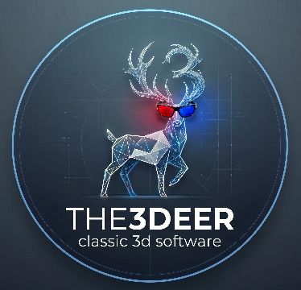

# Android 3D Software

## Website

- [The3Deer.org](https://the3deer.org/): Website

## Repositories

- [android-3D-engine](https://github.com/the3deer/android-3D-engine): Library for loading and parsing 3D models.
- [android-3D-viewer](https://github.com/the3deer/android-3D-model-viewer): View OBJ, STL, DAE or GLTF models.
- android-3D-isogame (wip): Play and train your neurons!

